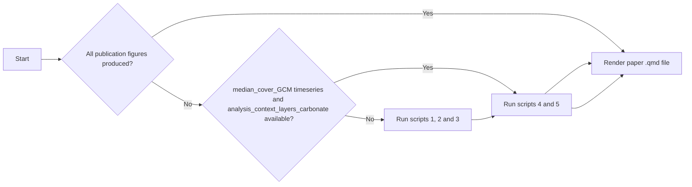

# ADRIA-reef-indicators

[](https://doi.org/10.5281/zenodo.16878443)

Time series analyses for GBR resilience using ADRIA - CoralBlox reef ecosystem modelling suite.
- Clustering reef timeseries to identify what characteristics define resilient clusters.
- Assessing the characteristics that influence positive carbonate budget maintainence into the future.

## Structure

Repository structure:
``` code
ADRIA-reef-indicators/
├─ src/     # Analysis scripts
├─ outputs/     # ADRIA results sets and analysis / figure outputs
├─ data/
├─ paper/   # Reproducible quarto manuscript via the rendering of .qmd file
├─ .gitignore
├─ config.toml  # configuration file for project
├─ Project.toml     # Julia project spec
├─ Manifest.toml    # Julia project spec
└─ README.md    # this file
```

The ADRIADomain `GBR_2024_10_15_HighResCoralStress` is required to run ADRIA in this project. The path to this domain folder should be specified in the config.toml file.

The following structure and files should be maintained in the outputs, figs and data folders:
``` code
ADRIA-reef-indicators
│───outputs
│   └───ADRIA_results
│       └───HighResCoralStress
│           ├───processed_model_outputs     # Folder containing scenario-median timeseries arrays for each GCM
│           │       ├───median_cover_ACCESS-CM2.nc
│           │       ├───median_cover_ACCESS-ESM1-5.nc
│           │       ├───median_cover_EC-Earth3-Veg.nc
│           │       ├─── median_cover_GFDL-CM4.nc
│           │       └───median_cover_NorESM2-MM.nc
│           └───analysis_context_layers_carbonate.gpkg      # Geopackage containing the required timeseries clustering, connectivity and carbonate budget values for each reef│
│───figs    # Directory directly containing general GCM-wide and paper-methods figures, as well as GCM subdirectories
│   ├───ACCESS-CM2
│   │   ├───bioregion
│   │   ├───gbr
│   │   └───management_area
│   ├───ACCESS-ESM1-5
│   │   ├───bioregion
│   │   ├───gbr
│   │   └───management_area
│   ├───EC-Earth3-Veg
│   │   ├───bioregion
│   │   ├───gbr
│   │   └───management_area
│   ├───GFDL-CM4
│   │   ├───bioregion
│   │   ├───gbr
│   │   └───management_area
│   └───NorESM2-MM
│       ├───bioregion
│       ├───gbr
│       └───management_area
└───data
    ├─ GBRMPA_Management_Areas.gpkg    # File containing polygons of GBRMPA management areas
    ├─ GBRMPA_Reef_Features.gpkg    # File containing polygons of GBRMPA reef feature data
    └─ GBRMPA_Reefal_Bioregions.gpkg   # File containing polygons of GBRMPA reefal bioregions.
```

### Analysis scripts - `src/ADRIA/HighResCoralStress/`

Note that scripts 1, 2 and 3 are only required to be run if creating model outputs from scratch.
If median cover timeseries and `analysis_context_layers_carbonate.gpkg` are already available in the relevant output structure, then scripts 4 and 5 can be run immediately.
If figures are already available, then the paper.qmd document can be rendered immediately.

Workflow:


- `1_GCM_model_runs.jl` : Script to run ADRIA - CoralBlox with the required ADRIADomain and produce processed median coral cover outputs.
- `2_timeseries_clustering_absolute.jl` : Perform timeseries clustering analysis on reef-area-scaled absolute coral cover. Analysis is performed at bioregion, management area and GBR wide scales. Cluster assignments for each reef are saved as `analysis_context_layers_carbonate.gpkg`
- `3_collating_context_layers.jl` : Attach the required values for each reef for analysis factors including connectivity metrics, reef DHW levels and perform carbonate budget analysis for a range of carbonate budget live coral cover thresholds.
- `4_analysis_plots_clustering_carbonate.jl` : Create required results for paper using timeseries data and analysis factors collated in `3_*.jl`. Additionally, calculate the proportion of reefs that change cluster assignment across the GCM levels and the proportion of reefs with depths of 1-10m that occur in low and medium coral cover clusters.
- `5_publication_plots.jl` : Create extra required plots for publication such as a context map and diagram of GCM Equilibium Climate Sensitivity values.
- `6_quantifying_cluster_differences.jl` : Quantify the differences between cluster timeseries across management areas and GCMs. (Does not need to be run as it is include()ed in the .qmd file).

### Raw Data Requirements

- `GBR-wide ADRIADomain data with HighResCoralStress DWHs` : **link uploaded domain M&DS**
- `GBRMPA management areas` : https://geohub-gbrmpa.hub.arcgis.com/datasets/management-areas
- `GBRMPA reef features` : https://geohub-gbrmpa.hub.arcgis.com/datasets/GBRMPA::great-barrier-reef-features
- `GBRMPA reefal bioregions` : https://geohub-gbrmpa.hub.arcgis.com/datasets/GBRMPA::reefal-marine-bioregions

## Methods

### Domain

Using GBR-wide ADRIADomain.

#### Includes:

- Initial coral cover data from RME
- DHW timeseries data from HighResCoralStress.org
- Reef spatial data from RME
- GBR1 connectivity data

### Scales

Timeseris clustering analyses are performed at bioregion, management area and GBR-wide scales. Only bioregion scale analyses are carried forward into the paper as findings are the same across the spatial scales.

### Timeseries clustering

Timeseries are clustered based on their complexity invariant distance (CID). The CID
corrects the Euclidean distance between pairs of timeseries (which accounts for magnitude
differences) with the complexity of each timeseries (obtained through a measure of their
variability) to ensure reefs are clustered based on their underlying temporal dynamics
rather than simply their average coral cover.
Reefs are clustered into 3 clusters based on these values, with clusters being assigned a
low, medium or high value based on their median-cluster coral cover from 2030-2050.

### Carbonate budget analysis

Reef health can be assessed by estimating the carbonate budget status. A positive
carbonate budget means that carbonate accumulation processes outweigh erosion and corals
can build the skeletal structures important to ecosystem functioning. We can estimate the
number of years a reef is predicted to have a positive carbonate budget but assuming a
live-coral-cover threshold above which a reef has a positive carbonate budget.
As this threshold is uncertain we explore a range of values and compare the results in
analyses.